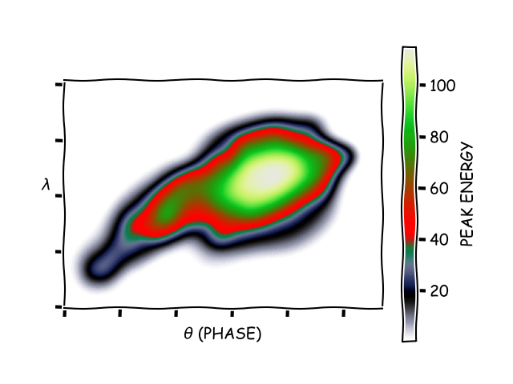

# Painbow colormap for Matplotlib
 (from xkcd [#2537](https://xkcd.com/2537))

## Usage

Simply import the colormap

```python
from painbow import cmap
```

... and use it:

```python
plt.imshow(image, cmap=cmap)
```

## Example



See [example.py](example.py) for how this was produced.

## Note
Color values and 2D example data taken from the [R implementation by Steve Haroz](https://github.com/steveharoz/painbow). Make sure to check out the [analysis](https://github.com/steveharoz/painbow#examples) of the colormap's qualities in the repo.


